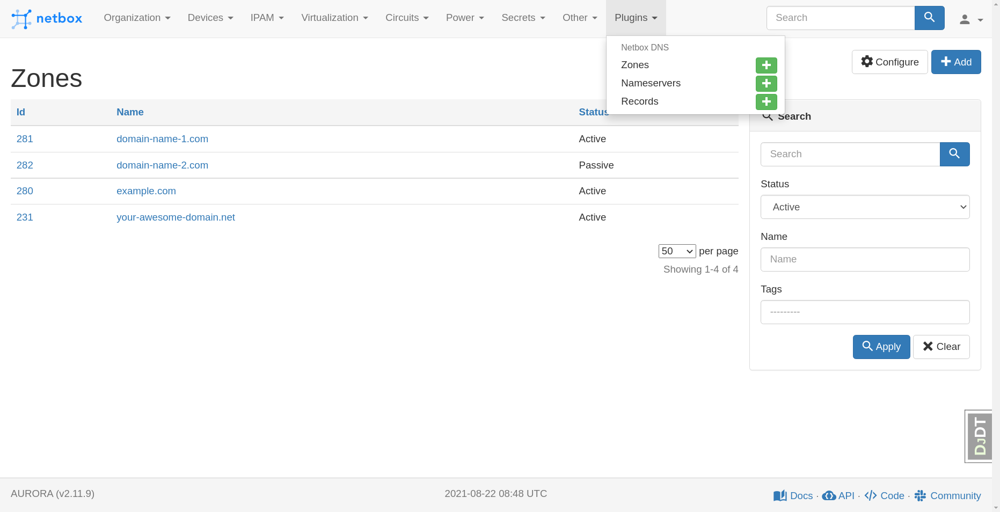
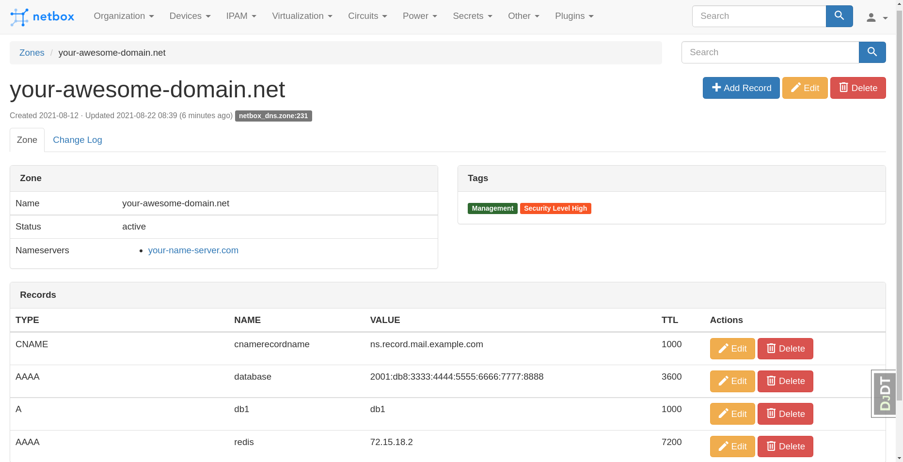

<h1 align="center">Netbox DNS</h1>

<p align="center"><i>Netbox Dns is a netbox plugin for managing zone, nameserver and record inventory.</i></p>

<div align="center">
<a href="https://github.com/auroraresearchlab/netbox-dns/stargazers"></a>
<a href="https://github.com/auroraresearchlab/netbox-dns/network/members"></a>
<a href="https://github.com/auroraresearchlab/netbox-dns/pulls"></a>
<a href="https://github.com/auroraresearchlab/netbox-dns/issues"></a>
<a href="https://github.com/auroraresearchlab/netbox-dns/graphs/contributors"></a>
<a href="https://github.com/auroraresearchlab/netbox-dns/blob/master/LICENSE"></a>
</div>

## Features

* Manage zones (domains) you have.
* Manage nameservers for zones.
* Manage zone records.
* Assign tags to zones, nameservers and records.

## Requirements

* Netbox 3.0
* python 3.7

## Installation

```
$ pip install netbox-dns
```

## Screenshots





## Contribute

Contributions are always welcome!

## License

MIT
