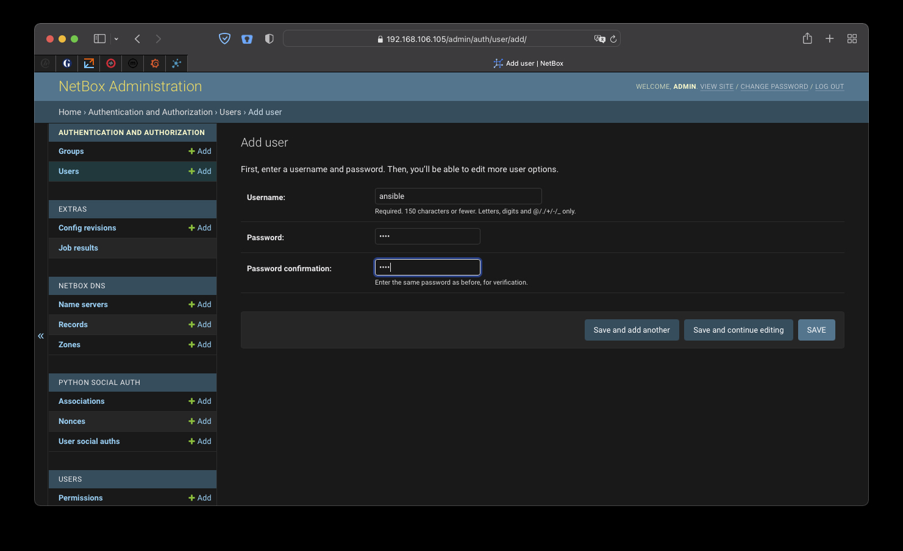
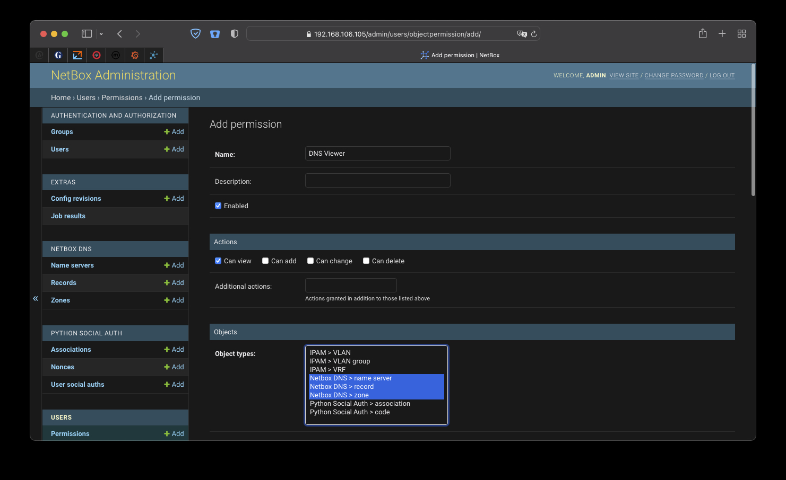
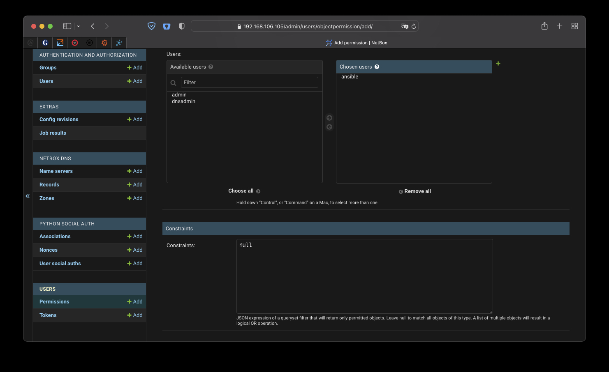
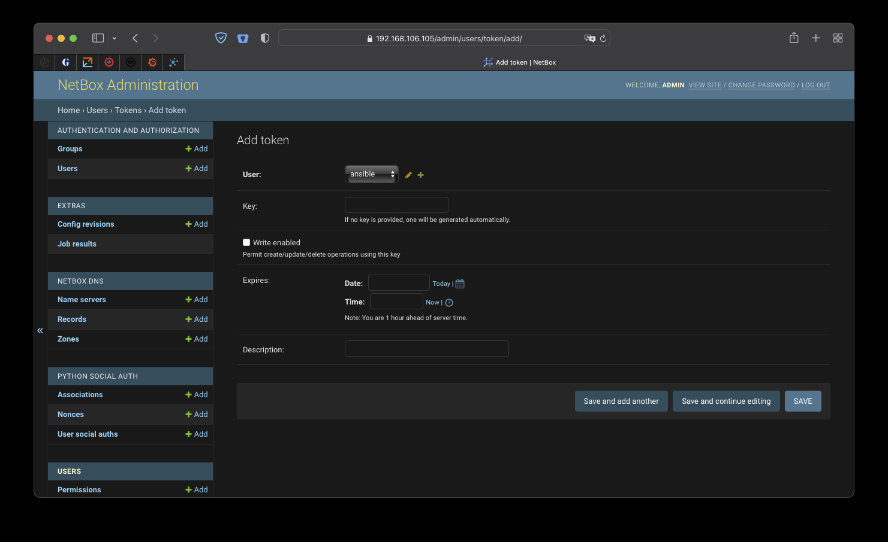
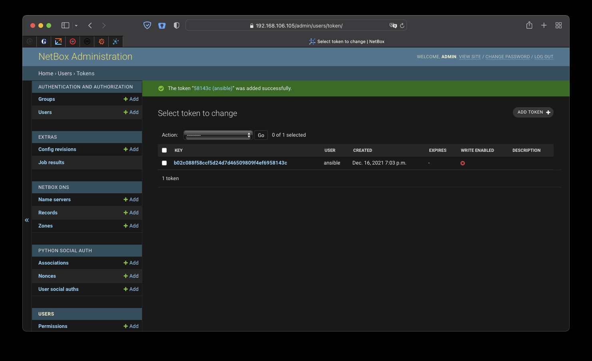
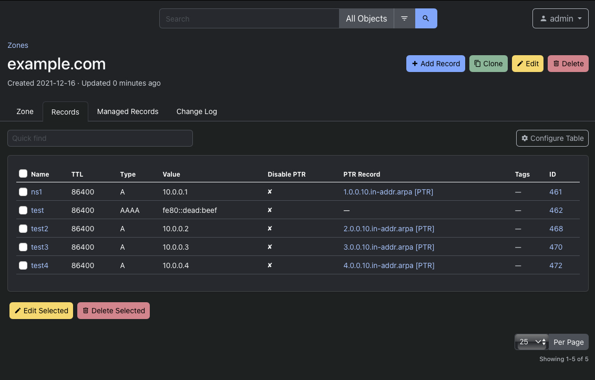

# Using Netbox DNS with Ansible
Netbox DNS aims to offer an easy to use and comfortable way of managing DNS data within Netbox. This document gives a brief introduction of how the data from Netbox DNS can be used to actually populate DNS servers with configuration and zones. This is not meant to be an exhaustive documentation of a DNS provisioning system ready for production, more to give an idea what can be done with Netbox DNS and the Netbox API.

This example uses Ansible and the `netbox.netbox` collection from Ansible Galaxy to show how a very simple integration can be implemented.

## Preparing Netbox
In order to use the Netbox API, a user account with an authentication token needs to be created. For the given purpose, a read-only user with access to the Netbox DNS data is sufficient.

Using the Django Admin interface for the Netbox instance, a new user named "ansible" is created. The password is irrelevant and should be sufficiently secure - any random password of reasonable length will do.



In the next step, a permission needs to be created that allows its holder to view all Netbox DNS data.



Scrolling further down, that permission can immediately be assigned to the newly created "ansible" user.



After sending that form, the new "ansible" user can view all DNS data within Netbox. The last step within the Django administration interface is to assign that user an API authentication token. This can be done unter the "Tokens" navigation item by clicking on "Add Token", selecting the "ansible" user and unchecking "Write enabled". 



Saving the new token will then display its value. That value can now be used to access the API from Ansible.



## Preparing Ansible
For the `netbox.netbox` collection to work, a recent version of Ansible running under Python 3 is required. Python 2 is not supported anymore and the Netbox collection is known not to work properly with Python 2.

### Installing the `netbox.netbox` collection for Ansible
Installing the collection is straightforward.

```
% ansible-galaxy collection install netbox.netbox
Starting galaxy collection install process
Process install dependency map
Starting collection install process
Downloading https://galaxy.ansible.com/download/netbox-netbox-3.4.0.tar.gz to ~/.ansible/tmp/ansible-local-84784t8afovr6/tmpox967fgb/netbox-netbox-3.4.0-ovt8ugjk
Installing 'netbox.netbox:3.4.0' to '~/.ansible/collections/ansible_collections/netbox/netbox'
netbox.netbox:3.4.0 was installed successfully
```

### Installing the `pynetbox` Python 3 Module
The `netbox.netbox` collection requires the `pynetbox` module to be installed.

```
% pip3 install pynetbox  
Collecting pynetbox
  Downloading pynetbox-6.4.0-py3-none-any.whl (31 kB)
Requirement already satisfied: six==1.* in /usr/local/lib/python3.9/site-packages (from pynetbox) (1.16.0)
Requirement already satisfied: requests<3.0,>=2.20.0 in /usr/local/lib/python3.9/site-packages (from pynetbox) (2.25.1)
Requirement already satisfied: idna<3,>=2.5 in /usr/local/lib/python3.9/site-packages (from requests<3.0,>=2.20.0->pynetbox) (2.10)
Requirement already satisfied: chardet<5,>=3.0.2 in /usr/local/lib/python3.9/site-packages (from requests<3.0,>=2.20.0->pynetbox) (4.0.0)
Requirement already satisfied: certifi>=2017.4.17 in /usr/local/lib/python3.9/site-packages (from requests<3.0,>=2.20.0->pynetbox) (2020.12.5)
Requirement already satisfied: urllib3<1.27,>=1.21.1 in /usr/local/lib/python3.9/site-packages (from requests<3.0,>=2.20.0->pynetbox) (1.26.3)
Installing collected packages: pynetbox
Successfully installed pynetbox-6.4.0
```

### Testing the API connection
Now the API connection can be tested by performing a simple lookup against Netbox. For the given purpose it is sufficient to use the `nb_lookup` plugin.

```
% ansible -m debug \
          -a "msg={{ query('netbox.netbox.nb_lookup', \
                           'nameservers', \
                           plugin='netbox_dns', \
                           api_endpoint='https://192.168.106.105/', \
                           token='b02c088f58ccf5d24d7d46509809f4ef6958143c') }}" localhost
```
The return value confirms that the user and its permissions are set up correctly and the token can be used to authenticate against Netbox and access data from Netbox DNS.

```
localhost | SUCCESS => {
    "msg": [
        {
            "key": 8,
            "value": {
                "created": "2021-12-16",
                "display": "ns1.example.com",
                "id": 8,
                "last_updated": "2021-12-16T14:39:52.603190Z",
                "name": "ns1.example.com",
                "tags": [
                    {
                        "color": "f44336",
                        "display": "PROD",
                        "id": 1,
                        "name": "PROD",
                        "slug": "prod",
                        "url": "http://192.168.106.105/api/extras/tags/1/"
                    }
                ],
                "url": "http://192.168.106.105/api/plugins/netbox-dns/nameservers/8/"
            }
        }
    ]
}
```

### Generating a zone file from Netbox DNS data
In the last step of this example, Netbox DNS data is used to create a zone file for e.g. a BIND nameserver.

#### Zone file template
A simple Jinja2 template to create a zone file is stored as `zone.db.j2`:

```
;
; Zone file for zone {{ zone.name }}
;

$TTL {{ zone.default_ttl }}


{{ record.name.ljust(32) }}    {{ (record.ttl|string).ljust(8) }} IN {{ record.type.ljust(8) }}    {{ record.value }}

```

#### Ansible playbook for creating a zone
A minimalistic playbook to create a zone from that template and the Netbox DNS data for the zone "example.com" used for the screenshots of this document can now be created as `create_zonefile.yml`:

```
#!/usr/bin/env ansible-playbook

- name: Create a sample zone file
  hosts: localhost
  tasks:

    - name: Create the zone file for zone {{ zone.name }}
      template:
          src: zone.db.j2
          dest: "{{ zone.name }}.db"
      vars:
          zone: "{{ query('netbox.netbox.nb_lookup', 'zones', plugin='netbox_dns',
                           api_endpoint='https://192.168.106.105/',
                           api_filter='name=example.com',
                           token='b02c088f58ccf5d24d7d46509809f4ef6958143c') 
                    | map(attribute='value') 
                    | first }}"
          records: "{{ query('netbox.netbox.nb_lookup', 'records', plugin='netbox_dns',
                             api_endpoint='https://192.168.106.105/',
                             api_filter='zone='+zone.name,
                             token='b02c088f58ccf5d24d7d46509809f4ef6958143c') 
                       | map(attribute='value') }}"
```

Running that playbook creates the zone file from the data in the Netbox DNS:

```
% ./create_zonefile.yml

PLAY [Create a sample zone file] ************************************************************************************

TASK [Create the zone file for zone example.com] ********************************************************************
changed: [localhost]

PLAY RECAP **********************************************************************************************************
localhost                  : ok=1    changed=1    unreachable=0    failed=0    skipped=0    rescued=0    ignored=0   
```

As a result, a very minimal but valid zone file is created:

```
;
; Zone file for zone example.com
;

$TTL 86400

@                                   86400    IN NS          ns1.example.com.
@                                   86400    IN SOA         (ns1.example.com hostmaster.example.com 1639680053 172800 7200 2592000 3600)
ns1                                 86400    IN A           10.0.0.1
test                                86400    IN AAAA        fe80::dead:beef
```

#### Updating zone data
Now some data can be added and the playbook run again to see what changes will be observed.



After running the playbook again, the resulting zone file now looks like this:

```
;
; Zone file for zone example.com
;

$TTL 86400

@                                   86400    IN NS          ns1.example.com.
@                                   86400    IN SOA         (ns1.example.com hostmaster.example.com 1639684610 172800 7200 2592000 3600)
ns1                                 86400    IN A           10.0.0.1
test                                86400    IN AAAA        fe80::dead:beef
test2                               86400    IN A           10.0.0.2
test3                               86400    IN A           10.0.0.3
test4                               86400    IN A           10.0.0.4
```

The new records have been inserted and the zone SOA SERIAL is updated in the SOA record.